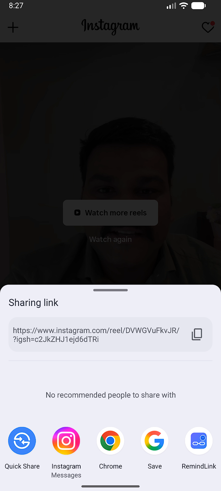
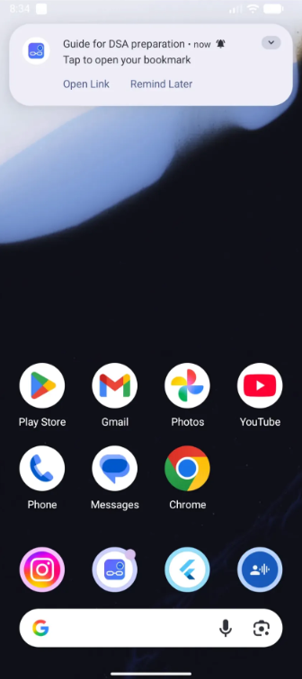
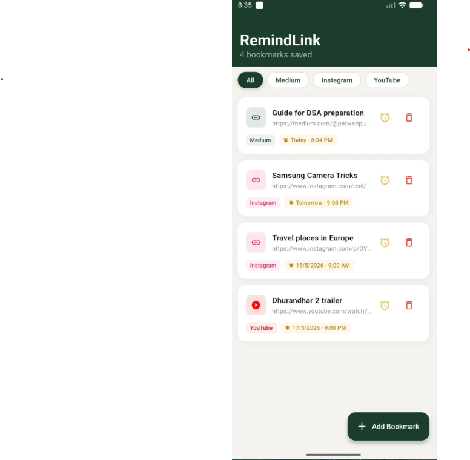

# RemindLink


> Never forget a link you saved.

Most bookmark apps give you a list. RemindLink gives you a memory.

Save any link, set a reminder, and get notified exactly when you want to revisit it — without ever opening the app again.

Currently in pre-launch testing on Google Play. Public release coming soon.

— -

## Screenshots

<div align="center">
  <table>
    <tr>
      <td align="center">
        
        <br/><sub><b>Share from any app</b></sub>
      </td>
      <td align="center">
        
        <br/><sub><b>Set Reminder</b></sub>
      </td>
      <td align="center">
        
        <br/><sub><b>Home Screen</b></sub>
      </td>
      <td align="center">
        
        <br/><sub><b>Notification Actions</b></sub>
      </td>
    </tr>
  </table>
</div>
—--

## Features

- **Save from anywhere** — Share any URL from Instagram, YouTube, Reddit, Twitter, or any browser directly into RemindLink. No copy-pasting.
- **Set precise reminders** — Scroll wheel date and time picker to choose exactly when you want to be reminded.
- **Auto-categorisation** — Bookmarks are automatically sorted by platform. Filter by Instagram, YouTube, Reddit and more with one tap.
- **Notification actions** — Open the link or snooze to a custom time directly from the notification. No need to open the app.
- **Completely private** — Everything is stored locally on your device. No accounts, no servers, no data collection. Works fully offline.

— -

## Privacy

RemindLink collects zero data. No analytics, no tracking, no servers. Everything stays on your device. No account required.

When cross-device sync is introduced in a future version, a privacy policy update will be published before that feature ships.

— -

## Tech Stack

| Layer | Technology |
| — — — -| — — — — — -|
| Language | Dart |
| Framework | Flutter |
| Database | Drift (SQLite) |
| Notifications | flutter_local_notifications |
| Storage | Local device only (no backend) |
| Platform | Android (iOS planned) |

— -

Write on Medium
## Getting Started

### Prerequisites

- Android Studio (latest stable)
- Android SDK 21+
- Flutter SDK 3.x

### Run locally
```bash
# Clone the repo
git clone https://github.com/rosshetty/remindlink.git

# Navigate to project
cd remindlink

# Install Flutter dependencies
flutter pub get

# Run on connected device or emulator
flutter run

# Build release APK for testing
flutter build apk — release

# Build release AAB for Play Store
flutter build appbundle
```

— -

## Status

- [x] Core save & remind flow
- [x] Share sheet integration
- [x] Auto platform detection & categorisation (50+ platforms)
- [x] Notification actions (Open Link / Remind Later)
- [x] Offline-first, no account required
- [x] Pre-launch testing on Google Play
- [ ] Google Play public release — coming soon
- [ ] iOS release — planned
- [ ] AI article summarisation — planned
- [ ] Cross-device sync — planned (paid feature)

— -

## Roadmap

| Feature | Status |
| — — — — -| — — — — |
| Save & remind (core) | ✅ Live |
| Share from any app | ✅ Live |
| Platform auto-categorisation | ✅ Live |
| Notification actions | ✅ Live |
| Google Play release | 🔄 In review |
| iOS release | 📅 Planned |
| AI summarisation | 📅 Planned (paid) |
| Cross-device sync | 📅 Planned (paid) |

— -

## License

Copyright © 2026 Roshan Shetty. All rights reserved.

This repository is publicly visible for portfolio and evaluation purposes only. The source code, design, and concepts contained herein are proprietary. Commercial use, copying, modification, or distribution of this code in whole or in part is not permitted without explicit written permission from the author.

— -

## Contact

Built by Roshan Shetty
Feedback: roshanshetty.apps@gmail.com
